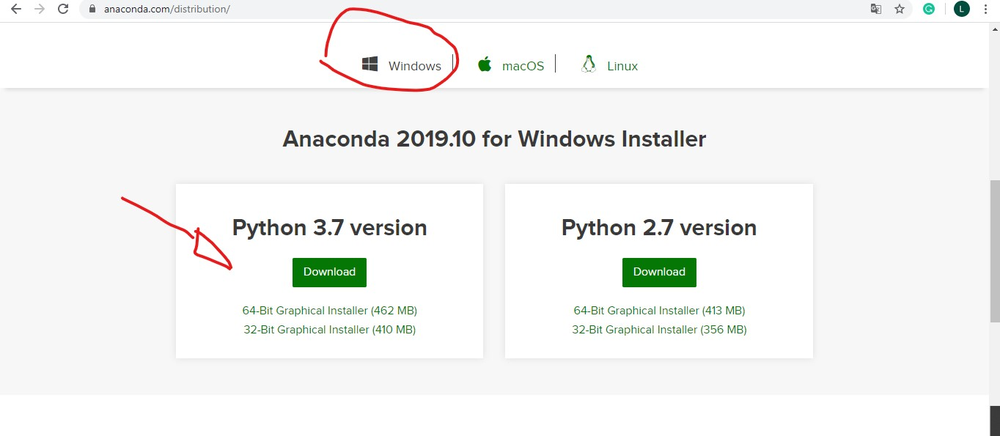
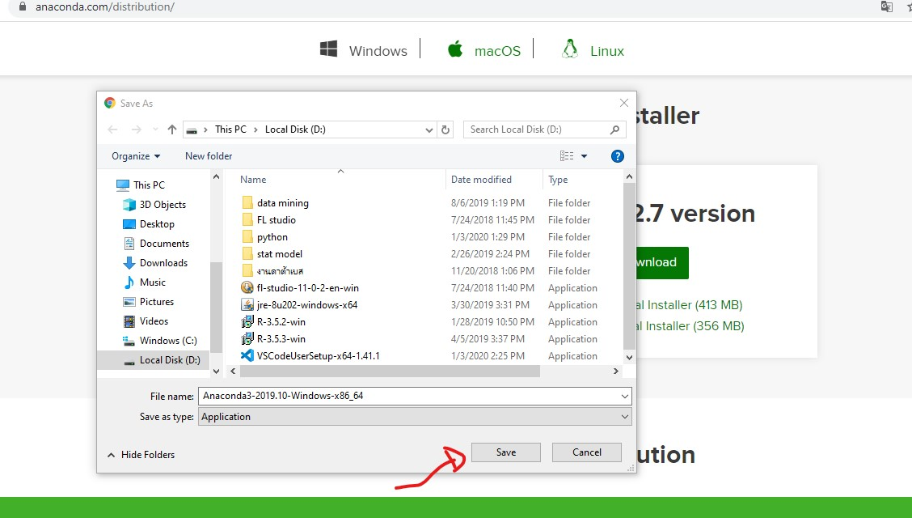
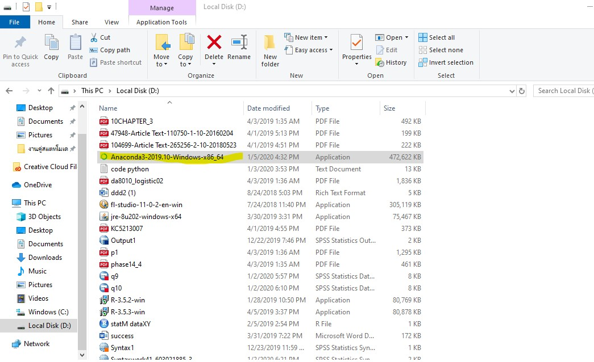
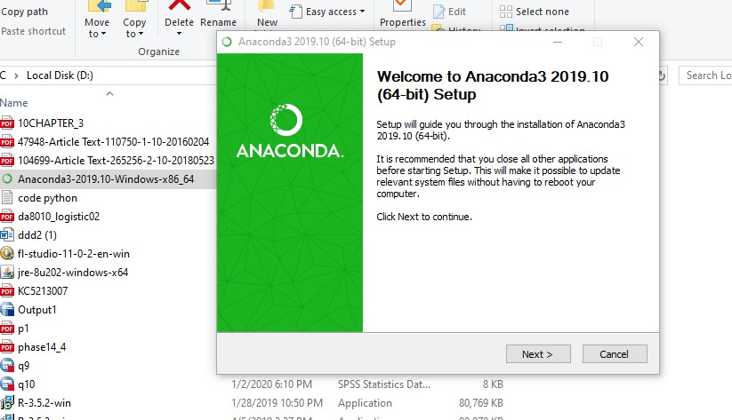
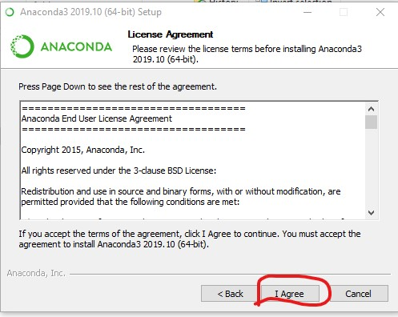
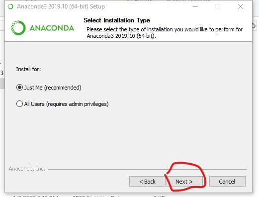
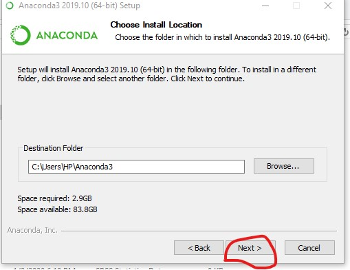
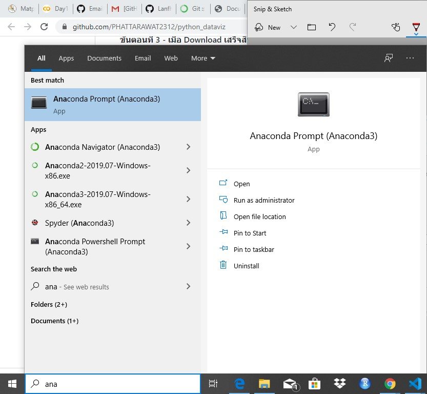
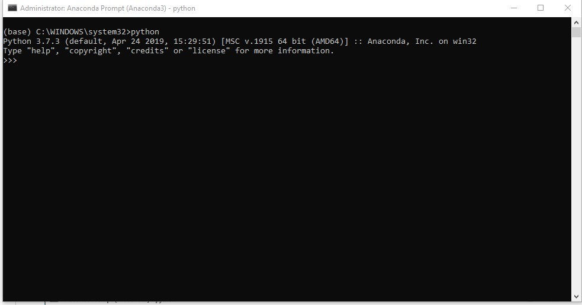
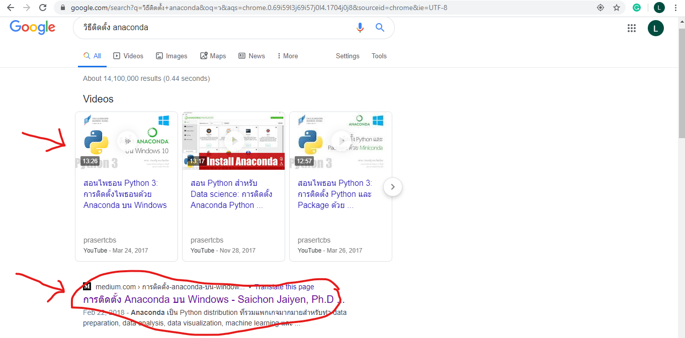

# python_dataviz

## Lanfha Boonrod
## 603021885-3
### วิธีติดตั้งโปรแกรม Miniconda

## 1.ทำการ Download ตัว Anaconda จากเว็ปไซส์ [https://www.anaconda.com/distribution/](https://www.anaconda.com/distribution/) จากนั้นทำการเลือกระบบปฏิบัติการที่เหมาะสมกับคอมพิวเตออร์ของท่านใช้และคลิ้กที่ Download ตามลูกศรชี้

## 2. ทำการกด Download เลือกที่ต้องการจะเก็บไฟล์ติดตั้งแล้วกด Save

## 3. เข้าไปที่ไฟล์ที่ทำการเก็บตัว download ไว้และทำการดับเบิ้ลคลิ้กเพื่อทำการติดตั้งโปรแกรม

## 4.เมื่อทำการดับเบิ้ลคลิ้กหน้าจอก็จะแสเงผลดังภาพ ให้ทำการกดปุ่ม "Next"เพื่อดำเนินการติดตั้ง

## 5คลิ้ก "I Agree"

## 6. เลือก "Just me (recomended)" แล้วกด "Next"

## 7. เลือกสถานที่ ที่ต้องการจะเก็บFolder install ลง แล้วกด Next

## 8 หลังจากทำการ install โปรแกรมเสร็จสิ้นให้มาเสิชหาตัวโปรแกรมที่ Tab bar ด้านล่างแล้วเสิชหาคำว่า "Anaconda" จะขึ้นดังรูปแล้วทำการคลิ้กเปิดโปรแกรมเพื่อใช้งาน

## 9 เมื่อเปิดโปรแกรมสำเร็จให้พิมคำว่า "python" เพื่อตรวจสอบว่าโปรแกรมได้ทำการ install ใน version ที่ลงสำเร็จพร้อมใช้งานแล้วดังรูป

# >>>[อ่านวิธีติดตั้งเพิ่มเติมคลิ้ก](https://mindphp.com/%E0%B8%9A%E0%B8%97%E0%B9%80%E0%B8%A3%E0%B8%B5%E0%B8%A2%E0%B8%99%E0%B8%AD%E0%B8%AD%E0%B8%99%E0%B9%84%E0%B8%A5%E0%B8%99%E0%B9%8C/83-python/6755-install-python-anaconda-on-windows-10.html) <<<

## หรือเสิช Google ตามภาพ

