# python_dataviz

## Lanfha Boonrod
## 603021885-3
#  วิธีติดตั้งโปรแกรม Miniconda

## 1.ทำการ Download ตัว Anaconda จากเว็ปไซส์ [https://www.anaconda.com/distribution/](https://www.anaconda.com/distribution/) จากนั้นทำการเลือกระบบปฏิบัติการที่เหมาะสมกับคอมพิวเตออร์ของท่านใช้และคลิ้กที่ Download ตามลูกศรชี้

## 2. ทำการกด Download เลือกที่ต้องการจะเก็บไฟล์ติดตั้งแล้วกด Save

## 3. เข้าไปที่ไฟล์ที่ทำการเก็บตัว download ไว้และทำการดับเบิ้ลคลิ้กเพื่อทำการติดตั้งโปรแกรม

## 4.เมื่อทำการดับเบิ้ลคลิ้กหน้าจอก็จะแสเงผลดังภาพ ให้ทำการกดปุ่ม "Next"เพื่อดำเนินการติดตั้ง

## 5คลิ้ก "I Agree"

## 6. เลือก "Just me (recomended)" แล้วกด "Next"

## 7. เลือกสถานที่ ที่ต้องการจะเก็บFolder install ลง แล้วกด Next

## 8 หลังจากทำการ install โปรแกรมเสร็จสิ้นให้มาเสิชหาตัวโปรแกรมที่ Tab bar ด้านล่างแล้วเสิชหาคำว่า "Anaconda" จะขึ้นดังรูปแล้วทำการคลิ้กเปิดโปรแกรมเพื่อใช้งาน

## 9 เมื่อเปิดโปรแกรมสำเร็จให้พิมคำว่า "python" เพื่อตรวจสอบว่าโปรแกรมได้ทำการ install ใน version ที่ลงสำเร็จพร้อมใช้งานแล้วดังรูป

# >>>[อ่านวิธีติดตั้งเพิ่มเติมคลิ้ก](https://mindphp.com/%E0%B8%9A%E0%B8%97%E0%B9%80%E0%B8%A3%E0%B8%B5%E0%B8%A2%E0%B8%99%E0%B8%AD%E0%B8%AD%E0%B8%99%E0%B9%84%E0%B8%A5%E0%B8%99%E0%B9%8C/83-python/6755-install-python-anaconda-on-windows-10.html) <<<

## หรือเสิช Google ตามภาพ

# 2. การใช้งาน Google Colab

1. เข้าไปที่ Google แล้วพิมคำว่า"colab"

2.เมื่อคลิ้กเข้ามาจะปรากฎหน้าดังกล่าว ให้ทำการ sign in ตรงที่ลูกศรชื่อ โดยใส่E-mail ของตนเอง
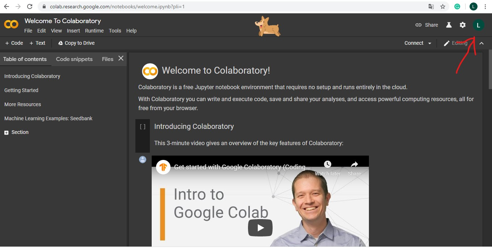
3.เมื่อทำการ Loing สำเร็จให้คลิ้กไปที่ File เลือกNew python3 หากต้องการที่จะเขียนcodeใหม่ หรือ open notebook เพื่อนำ Code ที่เขียนไว้แล้วมาทำต่อ

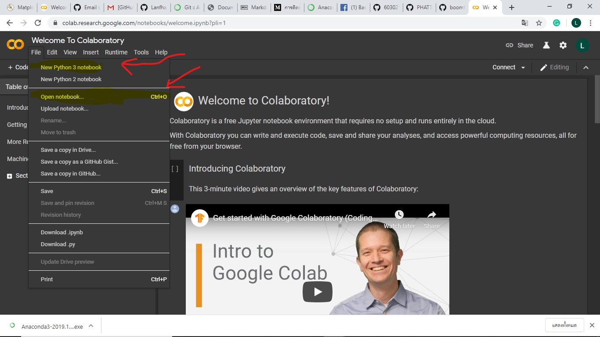

4. เลือกคลิ้กที่ open notebook เพื่อจะเลือกไฟล์ที่เคยเขียนโค้ดไว้แล้วมาเขียนต่อ
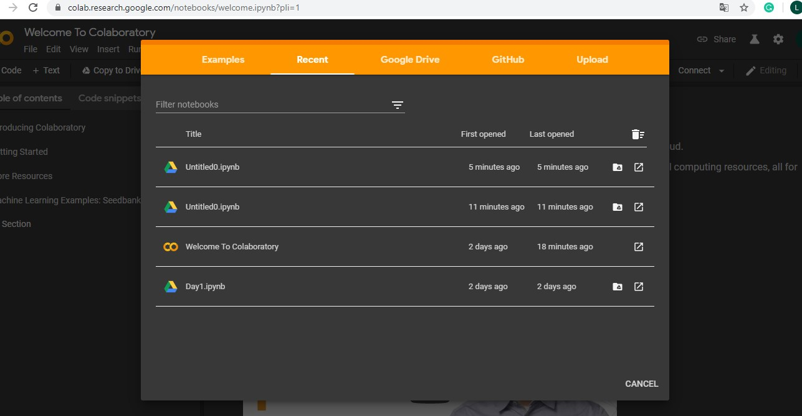
5. สามารถเขียนโค้ด โดยใช้าษา python ต่อได้เลย
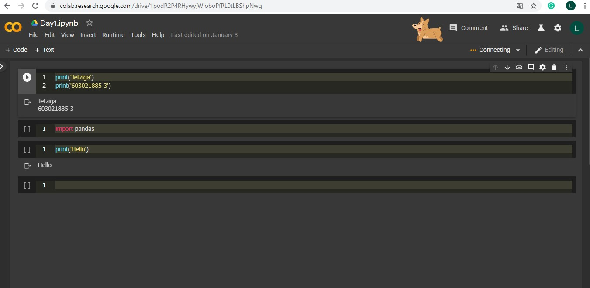

## ***การเขียนcodeใน Colab คือการเขียนโปรแกรมด้วย Pythonซึ่งต้องเชื่อต่อ internet ตลอดเวลา

# 3. การใช้งาน Github และ Anaconda
1. ทำการเข้าใช้งาน Github >>>[คลิ้กตรงนี้](https://github.com/)<<< และทำการสมัครใช้งานให้เรียบร้อย

2. เมื่อทำการสมัครเรียบร้อยหรือมีรหัสเข้าใช้งานอยู่แล้วให้กลิ้กที่ Sign in และทำการกรอก username และ password ให้เรียบร้อย >> คลิ้ก Sign in
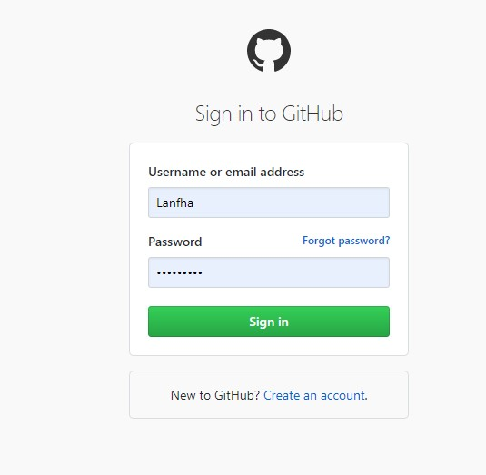
3. เมื่อทำการ Sign in เข้ามาเรียบร้อยให้คลิ้กที่เครื่องหมาย + ตามภาพและเลือกคำว่า "New repository"

4. ทำการตั้งชื่อ repository name และกำหนดสิทธิ์ผู้เข้าถึง หลังจากนั้นก็กด Create repository
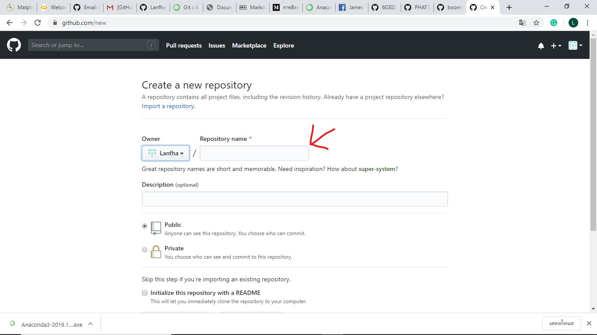
5. หลังจากนั้นทำการคัดลอก URL เพื่อทำการ clone file ไปที่ anaconda
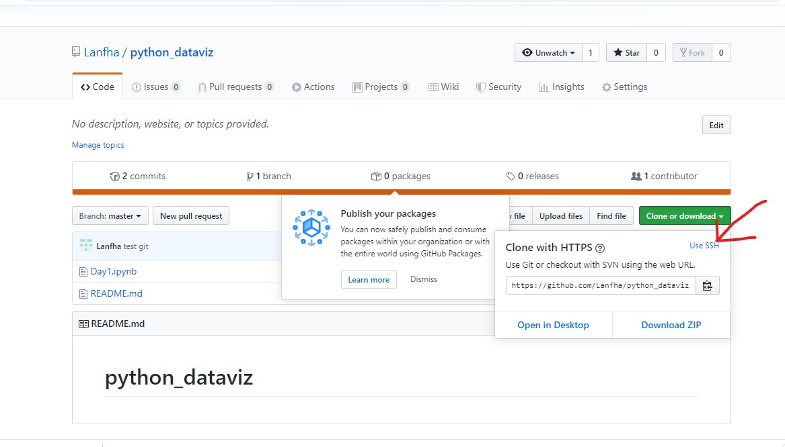
6. ทำการเปิดโปรแกรม Anaconda prompt ขึ้นมาและ ทำการ install git เพื่อเรียกใช้งานคำสั่งสั่ง git พิมว่า "conda install -c anaconda git" 

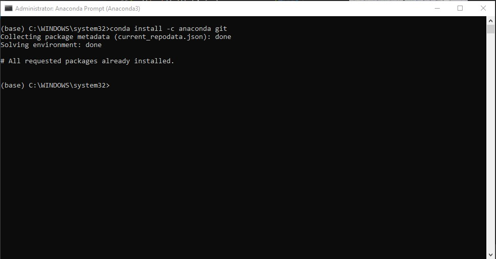
7. ทำการเชื่อมต่อไปยัง Folder ด้วยคำสั่ง cd ตามภาพ
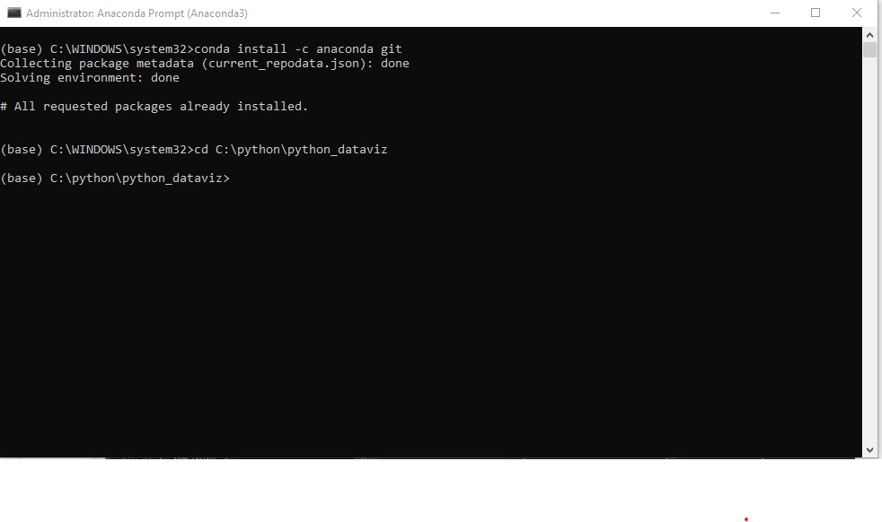

8. ทำการพิม git status เพื่อเช็คว่าทำการเชื่อมไฟล์เสร็จหรือยัง หากขึ้นสีแดงดังภาพหมายถึง ยังไม่เชื่อมขึ้นไป
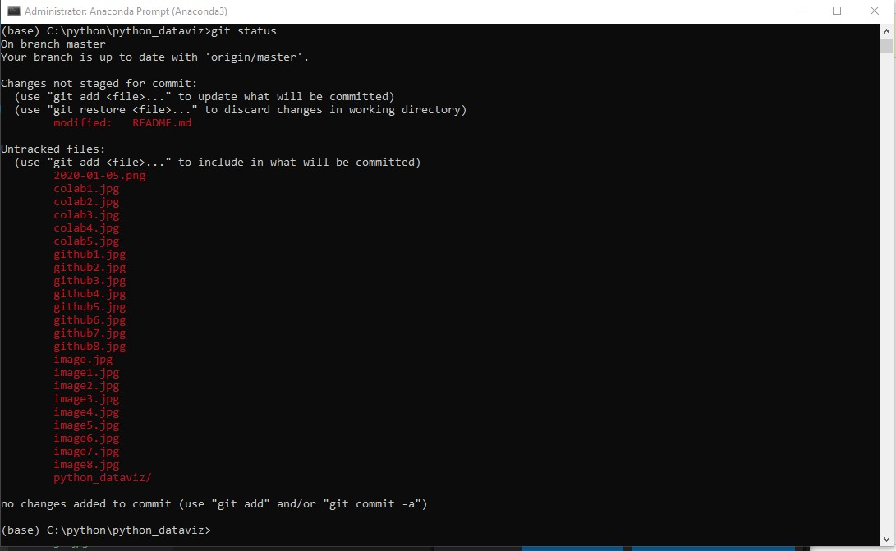
9. ให้ทำการ add ไฟล์เข้าไปใน git ด้วยคำสั่ง git add ตามด้วยชื่อไฟล์ และทำการcommit ด้วยคำสังgit commit -m "ชื่อไฟล์" หลังจากนั้นให้ทำการอัพโหลดขึ้นไปยัง git โดใช้คำสั่ง git push
โปรแกรมจะให้ใส่ usernameและ passwordเป็นอันว่าเสร็จสิ้น

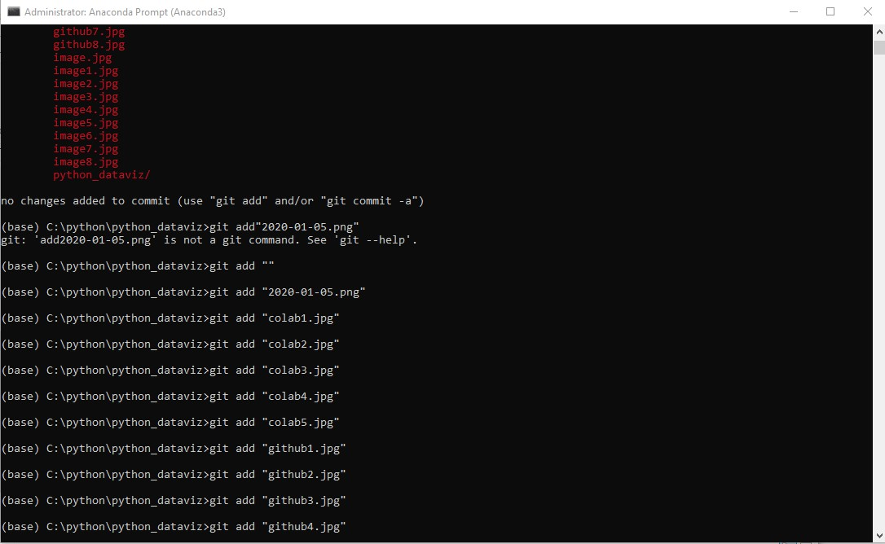
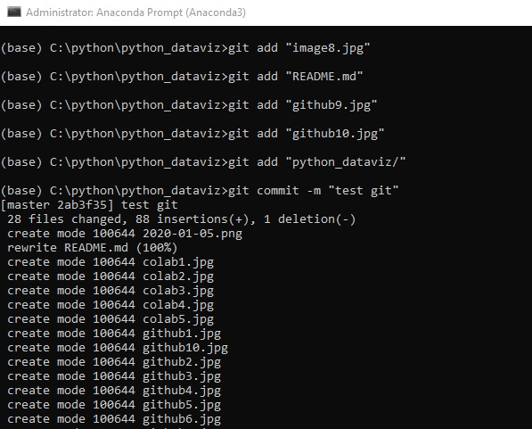
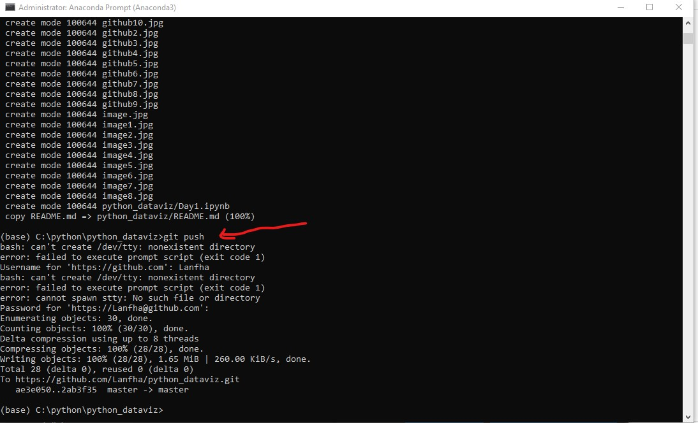

